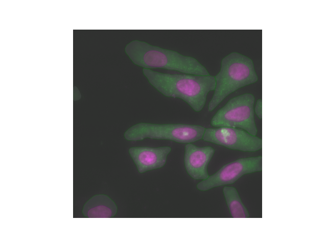

# Spatial Transcriptomics


Code for segmenting extracting spots from spatial transcriptomics data (smFISH).

## License

This project is licensed under the MIT License. See the [LICENSE](LICENSE) file for details.

## Setup Instructions

1. Clone the repository and navigate to the project directory.
2. Run the following command to set up the virtual environment:
   ```bash
   bash setup_env.sh
   ```
   This script will create a virtual environment, upgrade `pip`, and install all required dependencies.
3. Activate the virtual environment:
   ```bash
   source venv/bin/activate
   ```

## Running the Code

1. **Generate masks**:
   Run the following command to generate masks for the experiment:
   ```bash
   bash scripts/create_mask.sh
   ```
2. **Detect spots**:
   Run the following command to detect spots in the images:
   ```bash
   bash scripts/spot_detection.sh
   ```

## Dependencies

All dependencies are listed in the `requirements.txt` file. Install them using:
```bash
pip install -r requirements.txt
```

### Additional Notes

- **Synchronize files from the remote server**:
  Use the following command to synchronize files from the remote server to the local directory:
  ```bash
  rsync -a x-shaswata@anvil.rcac.purdue.edu:/home/x-shaswata/scratch/spatial_transcriptomics/Cytoplasm/test cellpose_data
  ```

- **Train a Cellpose model on the Nucleus dataset**:
  Train a Cellpose model using GPU with the following parameters:
  ```bash
  python -m cellpose --train --dir Nucleus/ --use_gpu --check_mkl --pretrained_model cyto --chan 2 --chan2 1 --diameter 300 --train --n_epochs 100 --verbose --mask_filter _seg.npy
  ```

- **Train a Cellpose model on the Cytoplasm dataset**:
  Train and test a Cellpose model on the Cytoplasm dataset:
  ```bash
  python -m cellpose --use_gpu --train --dir Cytoplasm/ --test_dir test/Cytoplasm/ --pretrained_model cyto3 --chan 2 --chan2 1 --learning_rate 0.1 --weight_decay 0.0001 --n_epochs 100 --mask_filter _seg.npy --verbose
  ```



### Scripts

- `create_mask.sh`: Generates the masks for the experiment.
- `spot_detection.sh`: Extracts the spots data once the masks have been generated.


